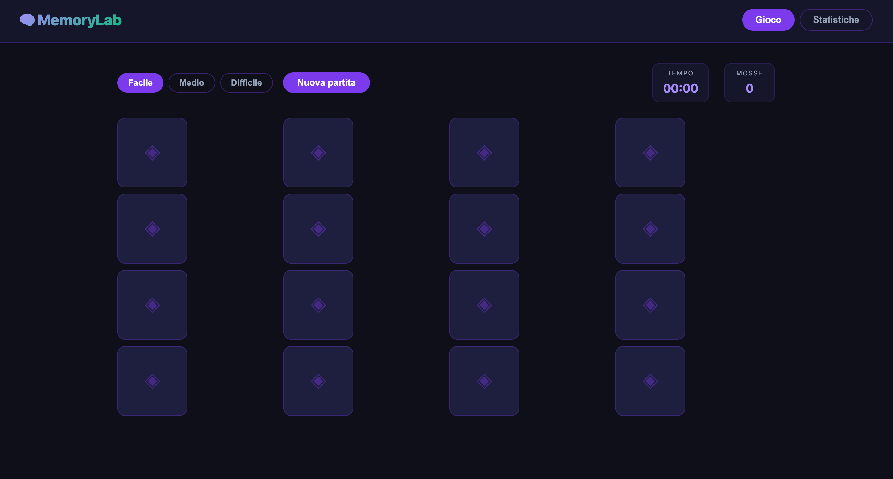

# Portfolio — Simone Guidi

Sito web portfolio personale. Singolo file `index.html` con CSS e JS inline, pronto per GitHub Pages.

---

## Struttura

```
portfolio-website/
├── index.html          # Tutto il sito (HTML + CSS + JS)
├── screenshots/        # Mockup dei progetti
│   ├── pycalc-mockup-1.png
│   ├── cryptoboard-mockup-1.png
│   ├── moodmapper-mockup-1.png
│   ├── flowboard-mockup-1.png
│   ├── devvault-mockup-1.png
│   └── datapulse-mockup-1.png
└── README.md
```

---

## Come aggiungere o sostituire screenshot

1. Metti la nuova immagine dentro `screenshots/` con un nome descrittivo (es. `memorylab-mockup-1.png`).
2. Apri `index.html` e cerca la card del progetto corrispondente.
3. Se c'è un `<div class="project-img-placeholder">`, sostituiscilo con:
   ```html
   
   ```
4. Se c'è già un ``, aggiorna l'attributo `src`.

> **MemoryLab** ha solo un file `.mov` nella cartella mockup — appena hai uno screenshot PNG, segui i passi sopra.

---

## Come aggiungere i link alle credenziali delle certificazioni

Ogni certificazione è una `<div class="cert-card">`. Per aggiungere un link:

1. Trova la card in `index.html` cercando il nome della certificazione.
2. Trasforma il `<div>` in un `<a>`:
   ```html
   <!-- Prima -->
   <div class="cert-card exam-card">
     <span class="cert-name">Cloudera Certified Data Engineer</span>
     ...
   </div>

   <!-- Dopo -->
   <a href="https://url-credenziale.com" target="_blank" rel="noopener" class="cert-card exam-card">
     <span class="cert-name">Cloudera Certified Data Engineer</span>
     ...
   </a>
   ```

---

## Come aggiornare i link GitHub dei progetti

Cerca in `index.html` la riga con il link del progetto:
```html
<a href="https://github.com/SimoneGuidi/pycalc" ...>GitHub →</a>
```
Sostituisci l'URL con quello corretto del repository.

---

## Come pubblicare su GitHub Pages

### Primo deploy

1. Crea un nuovo repository su GitHub (es. `portfolio` oppure `SimoneGuidi.github.io`).
2. Inizializza git ed effettua il primo push:
   ```bash
   cd ~/Desktop/portfolio-website
   git init
   git add .
   git commit -m "Initial portfolio deploy"
   git branch -M main
   git remote add origin https://github.com/SimoneGuidi/NOME-REPO.git
   git push -u origin main
   ```
3. Su GitHub: **Settings → Pages → Source → Deploy from a branch → main / root → Save**.
4. Dopo 1-2 minuti il sito sarà live su `https://SimoneGuidi.github.io/NOME-REPO/`.

> Se il repo si chiama `SimoneGuidi.github.io`, il sito sarà direttamente su `https://SimoneGuidi.github.io`.

### Aggiornamenti successivi

```bash
git add .
git commit -m "Descrizione aggiornamento"
git push
```
GitHub Pages si aggiorna automaticamente entro 1-2 minuti.

---

## Note tecniche

- **Nessuna dipendenza esterna** — solo Google Fonts (caricato via CDN).
- Font: Inter (testo) + JetBrains Mono (codice/accenti).
- Tema dark: sfondo `#0a0a0f`, accent `#6366f1`.
- Animazioni via `IntersectionObserver` (fade-in on scroll).
- Typewriter nella hero: cicla tra Software Developer, Backend Engineer, Data Engineer, Big Data Enthusiast.
- Hamburger menu per mobile (breakpoint 768px).
